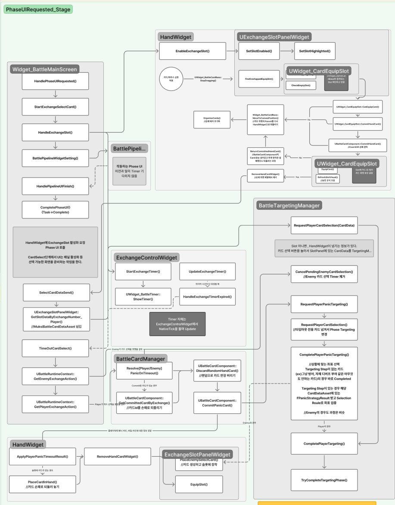

<h1 align="center">Muksi</h1>
<p align="center">Unreal Engine 5 기반 무협 턴제 카드 전투 게임</p>

<p align="center" style="line-height: 2;">
    
    
</p>

> 본 Repository는 포트폴리오 제출을 위해 실제 팀 프로젝트 Repository를 Fork한 저장소입니다.  
> Muksi는 현재 개발 진행 중인 프로젝트이며, 본 README에서는 제가 주로 담당하고 현재 구현이 완료된 **Battle System**을 중심으로 소개합니다.

<br/>

## 시연

> Battle System 시연

<!-- 시연 영상이 준비되면 추가 -->
<!--
[](Youtube URL)
-->

<!-- 또는 대표 전투 화면 추가 -->
<!--
<p align="center">
    
</p>
-->

<br/>

## 목차

- [프로젝트 소개](#프로젝트-소개)
- [담당 역할](#담당-역할)
- [Battle Flow](#battle-flow)
- [주요 구현](#주요-구현)
- [상세 흐름도](#상세-흐름도)
- [Battle System 구조](#battle-system-구조)
- [Troubleshooting](#troubleshooting)
- [개발 회고](#개발-회고)

<br/>

## 프로젝트 소개

Muksi는 무협 세계관을 기반으로 한 턴제 카드 전투 게임입니다.

플레이어와 적은 각 Exchange에서 카드를 선택하고 Target을 지정하며,
선택한 행동은 Simulation과 Battle Action Sequence를 거쳐 실제 전투로 실행됩니다.

현재 프로젝트 전체는 개발 진행 중이며,
본 포트폴리오에서는 제가 주로 담당한 Battle System과 Battle UI를 중심으로 설명합니다.

| 항목 | 내용 |
| --- | --- |
| 장르 | Turn-Based Card Battle |
| 엔진 | Unreal Engine 5.7.4 |
| 언어 | C++ |
| 개발 형태 | Team Project |
| 담당 영역 | Battle System / Battle UI |
| 개발 기간 | 2026.02 ~ 진행 중 |

<br/>

## 담당 역할

**Battle System / Battle UI Programming**

본 프로젝트에서 Battle System과 관련 UI를 중심으로 아래 기능을 직접 개발했습니다.

- `BattleManager` 기반 전체 전투 Phase 흐름 구현
- 각 Phase를 Entry / UI / Prep / Execution으로 구분하는 `BattlePhasePipeline` 구현
- `Widget_BattleMainScreen`을 중심으로 한 Battle UI 전체 흐름 구현
- Hand / Card / Exchange Slot 기반 카드 상호작용 UI 구현
- Phase에 따른 Battle UI 표시 및 완료 흐름 연동
- Enemy Card 선택 표시 및 Reveal 연출
- Exchange Timer 및 시간 초과 UI 처리
- 카드 Reveal / 변초 카드 공개 / 선·후공 표시 연출
- Battle Status HUD 및 Passive UI 등 전투 관련 UI 구현
- Battle System의 호출 흐름 분석 및 클래스별 책임 정리

> 팀 프로젝트이므로 아래에서는 제가 직접 개발한 Battle System과 UI를 중심으로 설명합니다.

<br/>

## Battle Flow

### Battle Phase

`BattleManager`에서 현재 Battle Phase를 관리하며
각 Phase가 완료되면 다음 Phase로 진행하도록 구성했습니다.

```text
ReadyStart
    ↓
ReadyEnd
    ↓
BattleStart
    ↓
RoundStart
    ↓
┌─────────────────────────────────────┐
│ ExchangeStart                       │
│      ↓                              │
│ CardSelect                          │
│      ↓                              │
│ Targeting                           │
│      ↓                              │
│ CardReveal                          │
│      ↓                              │
│ SimulationSequence                  │
│      ↓                              │
│ ExchangeEnd                         │
└─────────────────────────────────────┘
          ↓ Exchange 반복
BattleActionSequenceStart
    ↓
BattleActionSequenceEnd
    ↓
RoundEnd
    ↓
다음 Round 또는 BattleEnd
```

각 Exchange에서는 카드 선택, Target 지정, 카드 공개,
Simulation이 순차적으로 실행되고,
모든 Exchange가 종료되면 선택된 행동을 Battle Action Sequence에서 실행합니다.

<br/>

### Phase Stage

각 Battle Phase 내부의 동작은 다시 4개의 Stage로 구분했습니다.

```text
PhaseEntryRequested_Stage
          ↓
PhaseUIRequested_Stage
          ↓
PhasePrepRequested_Stage
          ↓
PhaseExecutionRequested_Stage
          ↓
       Next Phase
```

`BattlePhasePipeline`은 각 Stage에서 Delegate를 통해
해당 시스템에 처리를 요청하고,
등록된 작업이 완료된 이후 다음 Stage로 진행합니다.

> Stage의 비동기 완료 처리를 위한 `BattlePhaseTask`와
> `BattlePhaseTaskContext`는 프로젝트의 기존 시스템을 활용했으며,
> `BattlePhasePipeline`과 Battle Phase 흐름을 구현하여 해당 시스템과 연결했습니다.

<br/>

## 주요 구현

### 1. Battle Phase & Stage Pipeline

`BattleManager`에서 Battle의 현재 Phase를 관리하고,
각 Phase를 Entry → UI → Prep → Execution Stage로 순차 실행하도록 구성했습니다.

Phase 자체와 Phase 내부의 작업 단계를 분리하여
UI 연출이나 다른 시스템의 처리가 완료된 뒤 다음 단계로 진행할 수 있도록 했습니다.

#### 핵심 코드

새로운 Phase로 변경되면 `BattleManager`가 Entry Stage부터 실행합니다.

```cpp
void ABattleManager::ChangePhase(EBattlePhase NewPhase)
{
    if (CurrentPhase == NewPhase)
    {
        return;
    }

    PreviousPhase = CurrentPhase;
    CurrentPhase = NewPhase;

    ExecutePhaseEntry();
}
```

각 Stage가 완료되면 다음 Stage로 순차적으로 진행합니다.

```cpp
void ABattleManager::HandlePhaseEntryFinished(EBattlePhase FinishedPhase)
{
    if (!IsCurrentPhaseCompletion(FinishedPhase, TEXT("Entry")))
        return;

    ExecutePhaseUI();
}

void ABattleManager::HandlePhaseUIFinished(EBattlePhase FinishedPhase)
{
    if (!IsCurrentPhaseCompletion(FinishedPhase, TEXT("UI")))
        return;

    ExecutePhasePrep();
}

void ABattleManager::HandlePhasePrepFinished(EBattlePhase FinishedPhase)
{
    if (!IsCurrentPhaseCompletion(FinishedPhase, TEXT("Prep")))
        return;

    ExecutePhaseExecution();
}
```

`BattlePhasePipeline`에서는 Stage에 맞는 Delegate를 Broadcast하여
각 시스템이 필요한 작업을 수행하도록 요청합니다.

```cpp
void UBattlePhasePipeline::ExecutePhaseUI(
    EBattlePhase OldPhase,
    EBattlePhase NewPhase,
    FSimpleDelegate CompletionDelegate)
{
    UBattlePhaseTaskContext* StageContext =
        BeginStage(NewPhase, MoveTemp(CompletionDelegate));

    if (BattleManager && StageContext)
    {
        BattleManager->PhaseUIRequestedDelegate.Broadcast(
            OldPhase,
            NewPhase,
            StageContext
        );
    }

    SealStage(StageContext);
}
```

**관련 코드**
- `Source/Muksi/Contents/Battle/BattleManager.cpp`
- `Source/Muksi/Contents/Battle/BattleManager.h`
- `Source/Muksi/Contents/Battle/Flow/BattlePhasePipeline.cpp`
- `Source/Muksi/Contents/Battle/Flow/BattlePhasePipeline.h`

<br/>

### 2. Battle UI Flow

Battle UI의 전체 흐름은 `Widget_BattleMainScreen`을 중심으로 구성했습니다.

`BattleManager`의 `PhaseUIRequestedDelegate`를 받아
현재 Phase에 필요한 UI와 연출을 실행하고,
해당 UI 작업이 종료되면 Phase Pipeline에 완료를 전달합니다.

```text
BattleManager
      ↓
PhaseUIRequestedDelegate
      ↓
Widget_BattleMainScreen
      ↓
현재 Phase에 필요한 UI 실행
      ↓
Hand / Slot / Timer / Pipeline / Status UI
      ↓
UI 작업 완료
      ↓
Phase Pipeline 다음 Stage
```

#### 핵심 코드

현재 Phase에 따라 필요한 UI 로직을 분배합니다.

```cpp
void UWidget_BattleMainScreen::HandlePhaseUIRequested(
    EBattlePhase OldPhase,
    EBattlePhase NewPhase,
    UBattlePhaseTaskContext* TaskContext)
{
    PhaseUITask = nullptr;

    if (NewPhase != EBattlePhase::CardReveal && TaskContext)
    {
        PhaseUITask = TaskContext->RegisterTask(this);
    }

    switch (NewPhase)
    {
    case EBattlePhase::RoundStart:
        RoundStart();
        break;

    case EBattlePhase::ExchangeStart:
        ExchangeStart();
        break;

    case EBattlePhase::CardSelect:
        if (OldPhase != EBattlePhase::Targeting)
        {
            StartExchangeSelectCard(
                BattleManager->GetCurrentExchange()
            );
        }

        CompletePhaseUI(EBattlePhase::CardSelect);
        break;

    case EBattlePhase::CardReveal:
        CardRevealed();
        break;

    case EBattlePhase::ExchangeEnd:
        ExchangeEnd();
        break;

    default:
        CompletePhaseUI(NewPhase);
        break;
    }
}
```

UI 처리가 완료되면 등록했던 Task를 완료시켜
Phase Pipeline이 다음 Stage로 진행할 수 있도록 연결했습니다.

```cpp
void UWidget_BattleMainScreen::CompletePhaseUI(
    EBattlePhase FinishedPhase)
{
    if (!BattleManager ||
        BattleManager->GetCurrentPhase() != FinishedPhase)
    {
        return;
    }

    UBattlePhaseTask* CompletedTask = PhaseUITask;
    PhaseUITask = nullptr;

    if (CompletedTask)
    {
        CompletedTask->Complete();
    }
}
```

**관련 코드**
- `Source/Muksi/Private/Widgets/Battle/Widget_BattleMainScreen.cpp`
- `Source/Muksi/Public/Widgets/Battle/Widget_BattleMainScreen.h`
- `Source/Muksi/Widgets/Battle/PipeLine/BattlePipelineWidget.cpp`
- `Source/Muksi/Widgets/Battle/PipeLine/BattlePipelineWidget.h`
- `Source/Muksi/Widgets/Battle/StatusHUD/BattleStatusHUDWidget.cpp`
- `Source/Muksi/Widgets/Battle/Passive/PassiveActivePopupWidget.cpp`

<br/>

### 3. Card / Hand / Exchange Slot Interaction

플레이어가 Hand의 카드를 Drag하여
현재 Exchange의 Slot에 배치할 수 있도록 카드 UI를 구현했습니다.

Card Widget의 위치만 변경하는 것이 아니라,
실제 카드 데이터의 Commit과 UI Slot 장착을 연결하여
게임 데이터와 화면 상태가 함께 변경되도록 구성했습니다.

```text
Card Drag
    ↓
Exchange Slot Overlap 확인
    ↓
Card Data Commit
    ↓
Slot UI 장착
    ↓
Hand에서 Card Widget 제거
    ↓
Hand 재정렬
    ↓
Card 선택 완료 전달
```

UI 장착에 실패할 경우 먼저 Commit한 카드 데이터를
다시 반환하여 데이터와 UI 상태가 달라지는 상황을 방지했습니다.

#### 핵심 코드

```cpp
void UWidget_BattleCardBase::StopDragging()
{
    bIsDragging = false;

    if (OwningHandWidget)
    {
        UWidget_CardEquipSlot* OverlappedSlot =
            OwningHandWidget->FindOverlappedEquipSlot(this);

        if (OverlappedSlot &&
            OverlappedSlot->CanEquipCard(this))
        {
            // 게임 데이터에서 먼저 Card Commit
            if (OwningHandWidget->CommitHandCard(this))
            {
                // Commit 성공 후 UI Slot 장착
                if (OverlappedSlot->EquipCard(this))
                {
                    OwningHandWidget->RemoveHandCardWidget(this);

                    OwningHandWidget->OrganizeCards(
                        OwningHandWidget->GetDefaultCardSpacing()
                    );

                    OwningHandWidget->NotifyPlayerCardEquipped();
                    return;
                }

                // UI 장착 실패 시 Card Data 복구
                OwningHandWidget->ReturnCommittedHandCard(this);
            }
        }
    }

    MoveToCanvasPosition(CachedHandPosition);
}
```

**관련 코드**
- `Source/Muksi/Widgets/Battle/Widget_BattleCardBase.cpp`
- `Source/Muksi/Widgets/Battle/Widget_BattleCardBase.h`
- `Source/Muksi/Widgets/Battle/Hand/HandWidget.cpp`
- `Source/Muksi/Widgets/Battle/Hand/HandWidget.h`
- `Source/Muksi/Widgets/Battle/Widget_CardEquipSlot.cpp`
- `Source/Muksi/Widgets/Battle/Widget_CardEquipSlot.h`
- `Source/Muksi/Widgets/Battle/Hand/ExchangeSlot/ExchangeSlotPanelWidget.cpp`
- `Source/Muksi/Widgets/Battle/Hand/ExchangeSlot/ExchangeSlotPanelWidget.h`

<br/>

### 4. Exchange UI & Card Reveal

각 Exchange에서 카드 선택부터 제한 시간,
Enemy Card 공개까지 이어지는 UI 흐름을 구현했습니다.

- 현재 Exchange Slot 활성화
- Player Hand 활성화 및 카드 선택
- Enemy Card 선택 요청과 UI 연동
- Exchange 제한 시간 Timer
- 시간 초과 시 Panic 처리 결과 UI 반영
- Enemy Card 뒷면 표시 및 Reveal
- 선공 / 후공 Slot 연출
- 변초 카드의 실제 카드 공개 연출

#### Card Select

CardSelect가 시작되면 현재 Exchange Slot을 활성화하고,
Enemy 카드 선택을 요청한 뒤 제한 시간 Timer를 시작합니다.

```cpp
void UWidget_BattleMainScreen::StartExchangeSelectCard(
    int32 ExchangeIndex)
{
    if (!BattleManager ||
        ExchangeIndex != BattleManager->GetCurrentExchange())
    {
        return;
    }

    const int32 ExchangeNumber = ExchangeIndex + 1;

    HandleExchangeSlot(ExchangeNumber, true);

    if (BattleTargetingManager)
    {
        BattleTargetingManager->RequestEnemyCardSelection();
    }

    if (ExchangeControlWidget)
    {
        ExchangeControlWidget->StartExchangeTimer();
    }

    BattlePipelineWidgetSetting(EBattlePhase::CardSelect);
}
```

#### Enemy Card Reveal

CardReveal Phase가 시작되면 Timer를 종료하고
Enemy가 선택한 카드를 공개합니다.

Reveal이 완료된 이후에는 현재 Exchange의
선공 / 후공 정보를 Slot 연출로 표시합니다.

```cpp
void UWidget_BattleMainScreen::CardRevealed()
{
    if (!ExchangeControlWidget)
    {
        return;
    }

    ExchangeControlWidget->StopExchangeTimer();

    const int32 ExchangeIndex =
        BattleManager->GetCurrentExchange();

    if (!RevealEnemySelectedCard(ExchangeIndex))
    {
        HandleEnemyCardRevealFinished(ExchangeIndex);
    }
}
```

#### 변초 카드 공개

Battle Action 실행 전 가짜 카드가 사용된 경우,
현재 Slot의 Card Widget을 찾아 실제 카드를 공개하는 연출도 연결했습니다.

```cpp
bool UWidget_BattleMainScreen::PlayDeceiveCardReveal_Implementation(
    const FBattleAction& BattleAction,
    UMuksiBattleCardDataAsset* DeceivedCard,
    UMuksiBattleCardDataAsset* ActualCard)
{
    UExchangeSlotPanelWidget* ExchangeSlotPanel =
        HandWidget->GetExchangeSlotPanelWidget();

    UWidget_BattleCardBase* CardWidget =
        ExchangeSlotPanel->GetCardWidgetByExchangeIndex(
            BattleAction.ExchangeIndex,
            BattleAction.bPlayerAction
        );

    if (!CardWidget)
    {
        return false;
    }

    CardWidget->PlayDeceiveRevealEffect(DeceivedCard);
    return true;
}
```

**관련 코드**
- `Source/Muksi/Private/Widgets/Battle/Widget_BattleMainScreen.cpp`
- `Source/Muksi/Widgets/Battle/Hand/ExchangeControl/ExchangeControlWidget.cpp`
- `Source/Muksi/Widgets/Battle/Timer/Widget_BattleTimer.cpp`
- `Source/Muksi/Widgets/Battle/Hand/ExchangeSlot/ExchangeSlotPanelWidget.cpp`
- `Source/Muksi/Widgets/Battle/Widget_BattleCardBase.cpp`

<br/>

## 상세 흐름도

### CardSelect - PhaseUIRequested Stage

아래 흐름도는 전체 Battle Phase 중
**CardSelect Phase의 `PhaseUIRequested_Stage`**를 함수 단위로 정리한 자료입니다.

<p align="center">
  
</p>

> `Widget_BattleMainScreen`을 시작점으로 Hand, Exchange Slot,  
> Timer, Card 및 Targeting 관련 시스템으로 호출이 어떻게 이어지는지 정리한 흐름도입니다.
>
> Battle System의 책임과 호출 흐름을 팀원과 공유하기 위해  
> 실제 코드를 따라가며 Figma에 함수 단위로 정리했습니다.

[🔗 Figma에서 확대하여 상세 흐름 보기](https://www.figma.com/design/Utn3iyOoFEurf0v8SsA6QL/Muksi_Portfolio_BattleFlow?node-id=0-1&t=3MlWFX3hYDkjfRXZ-1)

<br/>

## Battle System 구조

```text
                        BattleManager
                             │
                      BattlePhasePipeline
                             │
          ┌──────────────────┼──────────────────┐
          │                  │                  │
       Entry               UI Stage          Prep / Execution
                             │
                  PhaseUIRequestedDelegate
                             │
                  Widget_BattleMainScreen
                             │
       ┌─────────────┬───────┼────────┬──────────────┐
       │             │       │        │              │
   HandWidget      Slot    Timer   Pipeline UI   Status / Passive UI
       │             │
 BattleCardWidget  ExchangeSlot
       │
 Card Drag / Select
```

`Widget_BattleMainScreen`은 Battle UI의 중심에서
각 Phase에 필요한 하위 UI를 제어하고,
Targeting, Card, Sequence 등 다른 Battle System과 UI 흐름을 연결합니다.

`BattleTargetingManager`, `BattleSequenceManager`,
`BattleCardManager` 등은 Battle 과정에서 연동되는 시스템이며,
본 README에서는 제가 담당한 `BattleManager`,
`BattlePhasePipeline` 및 Battle UI를 중심으로 설명했습니다.

<br/>

## Troubleshooting

### Battle Phase와 Execution System 통합 과정에서 책임이 중첩된 문제

**문제**

`BattleManager`의 Phase System을 개발하던 중
선행 개발되어 있던 캐릭터 행동 및 연출 처리용 Execution System을
하나의 Battle Flow로 통합해야 했습니다.

두 시스템을 각각 개발하는 과정에서 담당 영역이 점차 겹치기 시작했고,
통합 과정에서 전투 단계, UI, Execution의 책임이
여러 클래스에 중첩되는 문제가 발생했습니다.

이로 인해 기능을 수정하거나 추가할 때
여러 코드를 함께 확인해야 했고,
클래스별 역할도 불명확해 개발 진척이 느려졌습니다.

**해결**

각 Battle Phase의 Entry / UI / Prep / Execution Stage와
이후 Execution으로 이어지는 함수 호출을 실제 코드에서 하나씩 확인했습니다.

확인한 흐름을 Figma에 함수 단위의 순서도로 정리하고,
변수와 함수에서 서로 다르게 사용되던 용어의 정의도 팀원과 맞췄습니다.

이후 흐름도를 기준으로

- 전투 단계 진행
- 실제 전투 행동 실행
- UI 표시 및 연출

의 책임을 구분하고,
중복되어 있던 역할을 각 클래스에 맞게 분리했습니다.

**결과**

이후 새로운 Battle 기능을 추가할 때
Figma에 정리된 흐름을 기준으로
어느 클래스에서 기능을 구현해야 하는지,
어느 흐름으로 넘겨야 하는지를 바로 논의할 수 있게 되었습니다.

또한 어떤 함수를 통해 정보를 받아야 하고
다음 시스템에 무엇을 전달해야 하는지도 명확해져,
기능 간 연결에 필요한 인터페이스를 합의하는 과정이 수월해졌습니다.

<br/>

## 개발 회고

Muksi의 Battle System은 여러 Manager와 UI,
Card, Targeting, Execution System이 하나의 흐름으로 연결되는 구조였습니다.

개발 초기에는 기능을 구현하는 것에 집중하면서
각 시스템이 담당해야 할 역할이 겹치는 문제를 경험했습니다.

이를 해결하기 위해 전체 호출 흐름을 직접 추적하고,
Phase와 Stage를 기준으로 전투 진행 과정을 정리했으며,
UI 역시 `Widget_BattleMainScreen`을 중심으로
각 하위 Widget의 역할을 구분하는 방향으로 개선했습니다.

이 경험을 통해 복잡한 시스템에서는
기능 하나의 동작만 구현하는 것보다
각 클래스가 어떤 책임을 가지며
다음 시스템에 무엇을 전달해야 하는지를 명확하게 설계하는 것이
유지보수와 협업에 중요하다는 점을 배웠습니다.
